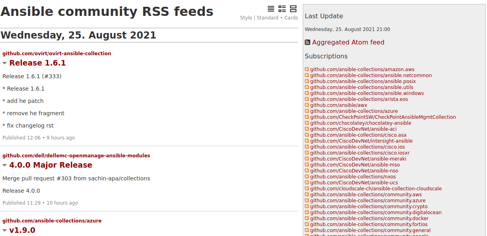

# rss-feed-aggregator

An opinionated implementation of the
[pluto](https://github.com/feedreader/pluto) RSS feed aggregator into a
blog-like interface for providing visibility and keeping up with releases of
Ansible community projects.

It is deployed and available here: https://rss.community.eng.ansible.com

## How it works

- GitHub provides RSS feeds for tags and releases, for example: https://github.com/ansible/ansible/tags.atom
- PyPi provides RSS feeds for project releases, for example: https://pypi.org/rss/project/ansible/releases.xml

In [roles/feed-aggregator/defaults/main.yaml](https://github.com/ansible-community/rss-feed-aggregator/blob/main/roles/feed-aggregator/defaults/main.yaml)
you'll find a list of Ansible collection repositories that are included in the
Ansible community package as well as PyPi project feed URLs.

These are templated into a [planet.ini](https://github.com/ansible-community/rss-feed-aggregator/blob/main/roles/feed-aggregator/templates/planet.ini.j2)
which is used by pluto to determine which feeds to fetch updates for.

pluto then builds a static HTML website aggregating all the feeds to a specified location, in this case ``/var/www/feed-aggregator``.

## TODO

- Some collections report an erroneous (or otherwise incorrect) repository URL in their galaxy.yml, see TODOs in ``roles/feed-aggregator/defaults/main.yaml``.
- openstack.cloud is hosted on gitea (although it is mirrored on github) and RSS support for gitea is a work in progress: https://github.com/go-gitea/gitea/issues/569
